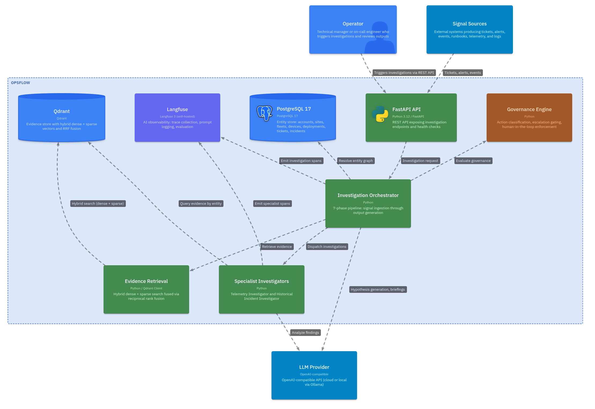

# OpsFlow

**An incident investigation layer that converges signals from several sources into one governed investigation over an entity graph.**

> **Status:** personal open-source alpha. Runs today on synthetic data. Being pointed at a real self-hosted service estate — see [where this is going](#where-this-is-going). Not for production use.

## Why this exists

During an incident, the information needed to understand it is scattered across alerts, uptime checks, deployment history, telemetry, runbooks and past tickets. A human stitches those together manually, under time pressure, and the connection that matters — this started six minutes after that rollout — is often the one nobody makes in time.

OpsFlow reconstructs that context. It runs a fixed seven-phase pipeline that converges multiple signals into a single investigation, resolves them against an entity hierarchy, retrieves evidence, consults specialist investigators, and produces bounded outputs with a full trace of how it got there. Humans stay in control of execution: the system investigates and recommends, it does not act.

## What this is / is not

**Is:**

- An investigation layer that sits on top of existing tools rather than replacing them
- A structured seven-phase pipeline with typed inputs and outputs at every stage
- A governance-bounded reasoning system — EXECUTE actions are blocked
- A personal open-source project, built on personal time with personal infrastructure

**Is not:**

- A platform replacement
- A production system — no security review, no real data handling, no SLA
- An autonomous remediation tool
- Built from any company's real data, workflows, or operational patterns

## Where this is going

The v1 pipeline is architecturally complete and empirically hollow. It runs end to end, but over invented data, with several components simulated — see [what is simulated](#what-is-simulated-or-stubbed) below. Every one of those simulations is a consequence of having no real signal source, not of a design flaw.

So the current work points the same architecture at a real self-hosted estate of around twenty containerised services, and migrates the workload onto a k3s cluster provisioned with Terraform. That estate supplies real versions of every signal the architecture already models — including the one that was hardest to fake convincingly, deployment adjacency, because every image is pinned by digest and every deployment is a git commit.

The plan is in [`.sisyphus/plans/opsflow-homelab.md`](.sisyphus/plans/opsflow-homelab.md).

## What works today

- Seven-phase investigation pipeline runs end-to-end: signal ingestion, entity resolution, evidence retrieval, specialist investigation, hypothesis generation, governance evaluation, output generation
- Entity model with 10 types: Account, Site, Fleet, Device, Service, Deployment, SoftwareRevision, Incident, Ticket, OperationalEvent
- Governance engine classifies actions into 5 categories (INVESTIGATE, RECOMMEND, ESCALATE, COMMUNICATE, EXECUTE), blocks EXECUTE in v1, gates by severity/confidence/sensitivity
- Langfuse trace emission for every investigation phase — prompts, evidence, hypotheses, governance decisions are all inspectable
- Docker Compose stack comes up cleanly: Postgres, Qdrant, Langfuse (with ClickHouse and Redis), Prometheus, Grafana
- FastAPI endpoints: `GET /healthz`, `POST /seed`, `POST /investigations`
- Two specialist investigators: Telemetry (device/fleet metrics analysis) and Historical Incident (pattern matching, deployment adjacency)

## What is simulated or stubbed

- **Vectors are deterministic hashes, not real embeddings.** Qdrant receives 384-dim vectors generated by SHA-256 of document IDs. The RRF fusion architecture is real; the dense vectors are not semantically meaningful. Embedding provider integration is a planned next step.
- **Sparse vectors are word-count bags, not BM25.** Keyword search splits the query on whitespace and counts occurrences. Functional for the demo scenario, but not production retrieval quality.
- **Entity resolution is demo-shaped.** The seed data has one account, one site, one fleet, one incident scenario. Resolution logic works for this case but has not been tested across ambiguous or overlapping entity graphs.
- **Specialist analysis is rule-based.** Both investigators match keywords in evidence content (e.g., "navigation_error_rate", "sensor_fusion_latency"). LLM-enhanced analysis is supported but optional — the system defaults to rule-based logic.
- **All evidence is synthetic.** The 11 evidence documents (historical tickets, runbooks, telemetry snapshots, deployment manifests) are invented. They exist as a fixture to exercise the pipeline, not as a demonstration of a domain. No real operational data enters the system.

## Connect rather than replace

OpsFlow is designed to sit on top of existing tools — ticketing systems, documentation, telemetry platforms, code repositories, communication channels — not replace them. The architecture assumes connectors to these systems that feed signals and evidence into the investigation pipeline.

Today's connectors are stubs against synthetic data. The entity model, retrieval layer, and governance engine are built to accommodate real integrations, but none are wired yet. This is the primary gap between the current alpha and a useful tool.

## Architecture

Architecture diagrams are maintained as a LikeC4 model in [docs/architecture](docs/architecture/README.md).



The model covers the system context, container view, seven-phase investigation flow, and observability stack. The interactive architecture site is published at:

https://cgracia.github.io/opsflow/

## Quick start

```bash
git clone https://github.com/cgracia/opsflow.git && cd opsflow
cp .env.example .env
# Edit .env: set LLM_API_KEY (optional — system works without it using rule-based analysis)
# Edit .env: set LANGFUSE_PUBLIC_KEY and LANGFUSE_SECRET_KEY for investigation tracing

docker compose up -d

# Verify the API is healthy
curl -sf http://localhost:8000/api/v1/healthz

# Seed synthetic entity data and evidence
curl -sf -X POST http://localhost:8000/api/v1/seed

# Run a multi-signal investigation
curl -sf -X POST http://localhost:8000/api/v1/investigations \
  -H 'Content-Type: application/json' \
  -d '{"signal_ids": {"ticket_id": "TCK-1001", "alert_id": "ALT-2001", "event_id": "EVT-3001"}}'
```

Ports: API at `:8000`, Qdrant at `:6333`, Langfuse at `:3000`, Grafana at `:3100`, Postgres at `:5432`.

The IDs above address a synthetic fixture scenario, which is currently the only way to exercise the pipeline. The endpoint returns a full `InvestigationResponse`: entity context, evidence retrieved, specialist reports, hypotheses, governance decision, and two output drafts. See [the fixture scenario](docs/demo-scenario.md) for expected output.

## Investigation flow

Every investigation follows seven fixed phases, executed in order:

1. **Signal Ingestion.** Receive ticket, alert, and event identifiers. Validate and normalize into a unified signal set.
2. **Entity Resolution.** Map signals to the affected entity graph: Account, Site, Fleet, Device, Service, Deployment, SoftwareRevision.
3. **Evidence Retrieval.** Query Qdrant with hybrid search (dense + sparse, fused via RRF), filtered by entity IDs and source types.
4. **Specialist Investigation.** Dispatch to domain-specific investigators. Telemetry Investigator analyzes device metrics. Historical Incident Investigator searches past incidents, runbooks, and deployment records.
5. **Hypothesis Generation.** Synthesize evidence, telemetry findings, and historical patterns into ranked hypotheses with confidence scores.
6. **Governance Evaluation.** Classify the action (INVESTIGATE, RECOMMEND, ESCALATE, COMMUNICATE, EXECUTE). Block EXECUTE. Gate sensitive operations. Flag escalation for high-severity customer-facing incidents.
7. **Output Generation.** Produce two bounded outputs: an internal operator briefing and a customer-safe response draft.

## Stack

| Component | Technology |
|-----------|-----------|
| API | Python 3.12, FastAPI, Pydantic v2 |
| ORM | SQLAlchemy 2.0 (async) |
| Entity store | PostgreSQL 17 |
| Evidence store | Qdrant (hybrid dense + sparse vectors, RRF fusion) |
| LLM | OpenAI-compatible API (optional — rule-based fallback) |
| Tracing | Langfuse 3 (self-hosted) |
| Metrics | Prometheus |
| Dashboards | Grafana |
| Runtime | Docker Compose |

## Repository layout

`python/` is the engine and the whole of the project. A Rust CLI that shared this
repository until September 2026 was extracted to its own repository, `praxis`,
with its history intact; it solved an unrelated problem.

`AGENTS.md` is the canonical reference for anyone — human or agent — working in
this repository.

## License

MIT
